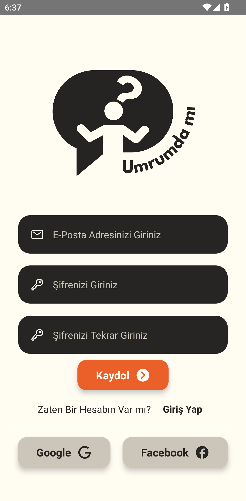
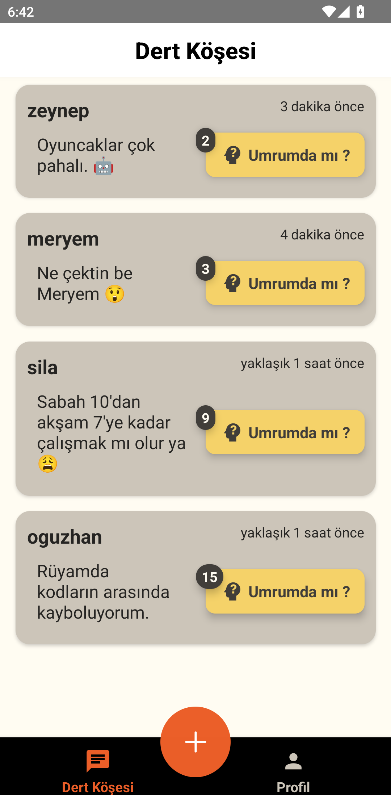
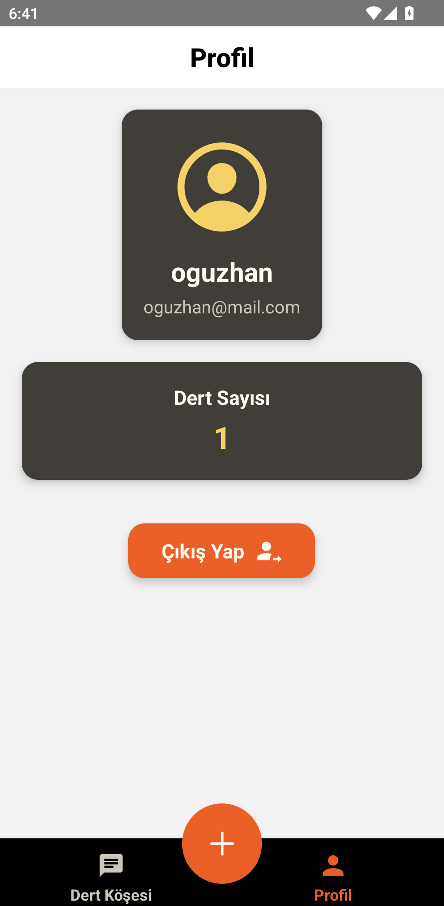

# Umrumda mı? -App
React Native ve çeşitli teknolojilerle geliştirilen "Umrumda mı?" adlı insanların dertlerini paylaşıp dönüt alacağı bir mobil uygulama.  Developed with React Native and various technologies, “Umrumda mı?” is a mobile application where people can share their problems and get feedback.

## Overview / Genel Bakış

**English:**  
Developed with React Native and various technologies, “Umrumda mı?” is a mobile application where people can share their problems and get feedback. The app features user authentication and a chat area where users can share messages. It is designed to be simple and intuitive, providing a smooth user experience.  

**Türkçe:**  
React Native ve çeşitli teknolojilerle geliştirilen "Umrumda mı?" adlı insanların dertlerini paylaşıp dönüt alacağı bir mobil uygulama. Uygulama, kullanıcı kimlik doğrulaması  ve kullanıcıların mesaj paylaşabileceği bir sohbet alanı gibi özelliklere sahiptir. Basit ve kullanıcı dostu bir deneyim sunmak üzere tasarlanmıştır.

## Features / Özellikler

- **User Authentication / Kullanıcı Kimlik Doğrulama**: Users can sign up and log in using email and password.
  - Kullanıcılar e-posta ve şifre ile kayıt olabilir ve giriş yapabilirler.
- **Social Media Login / Sosyal Medya ile Giriş**: Google and Facebook login options are integrated.
  - Google ve Facebook ile giriş seçenekleri entegre edilmiştir.
- **Message Sharing / Mesaj Paylaşımı**: Users can share and view messages in a community chat area.
  - Kullanıcılar topluluk sohbet alanında mesaj paylaşabilir ve görüntüleyebilirler.
- **User Profile / Kullanıcı Profili**: Profile management features including updating user information.
  - Kullanıcı bilgilerini güncellemeyi içeren profil yönetim özellikleri.

## Technologies Used / Kullanılan Teknolojiler

- **React Native**: Cross-platform mobile app development framework.
  - Çapraz platform mobil uygulama geliştirme framework'ü.
- **Firebase Authentication**: User authentication and social login features.
  - Kullanıcı kimlik doğrulama ve sosyal giriş özellikleri.
- **Firebase Realtime Database**: Storing and retrieving user messages in real-time.
  - Kullanıcı mesajlarını gerçek zamanlı olarak depolama ve alma.
- **React Navigation**: Navigation between different screens and tabs within the app.
  - Uygulama içindeki farklı ekranlar ve sekmeler arasında gezinme.
- **Formik & Yup**: Form management and validation for handling user input.
  - Kullanıcı girişi için form yönetimi ve doğrulama.

## Installation / Kurulum

**English:**  
1. Clone the repository: `git clone https://github.com/oguzhanyavass/Umrumda_mi_App.git`
2. Navigate to the project directory: `cd oguzhanyavass`
3. Install the dependencies: `npm install`
4. Run the application: `npm start` or `npx react-native run-android` for Android or `npx react-native run-ios` for iOS.

**Türkçe:**  
1. Depoyu klonlayın: `git clone https://github.com/oguzhanyavass/Umrumda_mi_App.git`
2. Proje dizinine gidin: `cd oguzhanyavass`
3. Bağımlılıkları yükleyin: `npm install`
4. Uygulamayı çalıştırın: `npm start` veya Android için `npx react-native run-android`, iOS için `npx react-native run-ios`.

## Screenshots / Ekran Görüntüleri

  
  
  
  
  
  

## Contact / İletişim

- **GitHub**: [oguzhanyavass](https://github.com/oguzhanyavass)
- **Email**: oguzhan.yavas@ogr.sakarya.edu.tr
